# Jenkins Lab 2

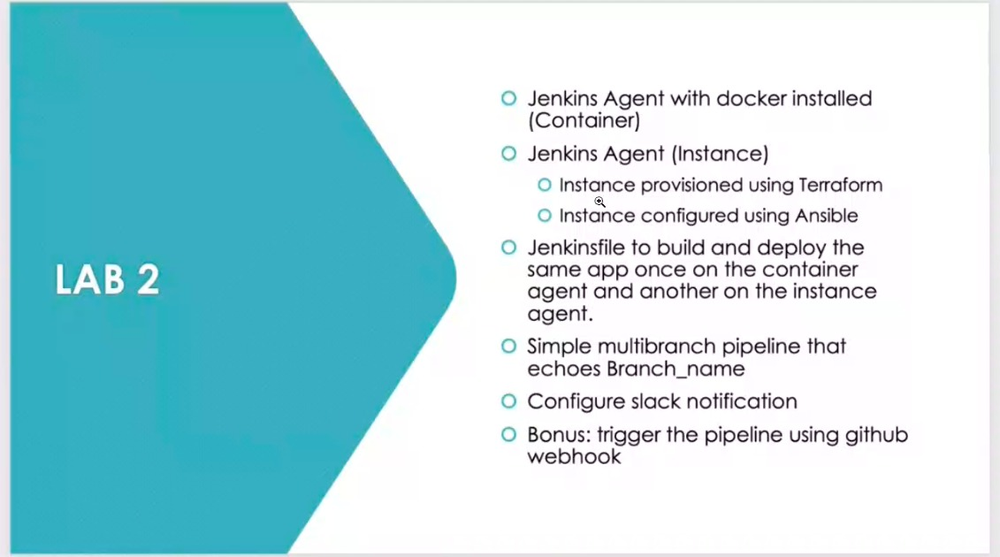

### Docker local node

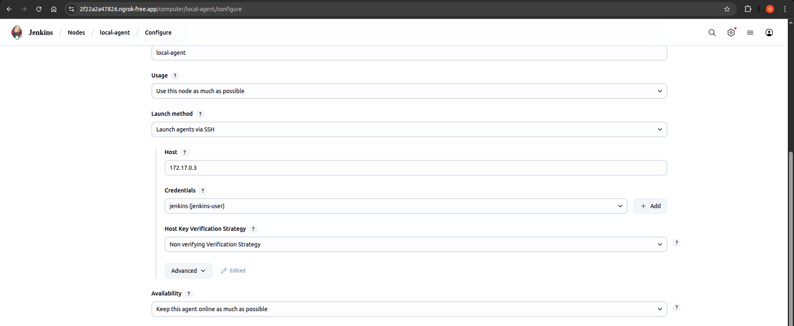

### EC2 node
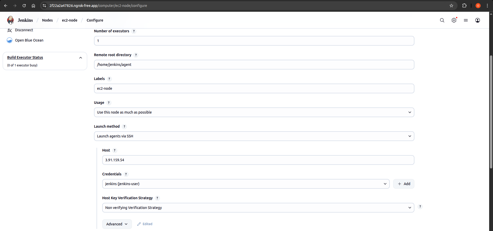

### All Nodes 
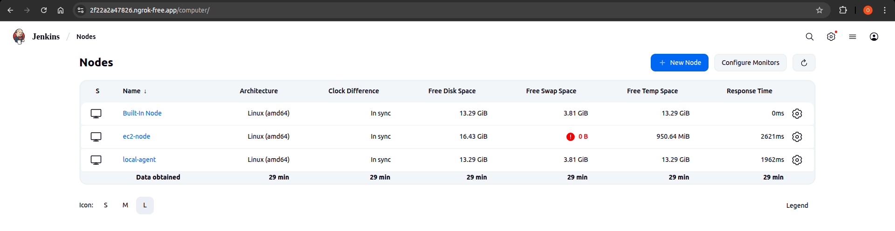

## Terraform
- terraform runs and creates ansible's `inventory.ini` in `/ansible` dynamically using `local_file` resource.

## Ansible
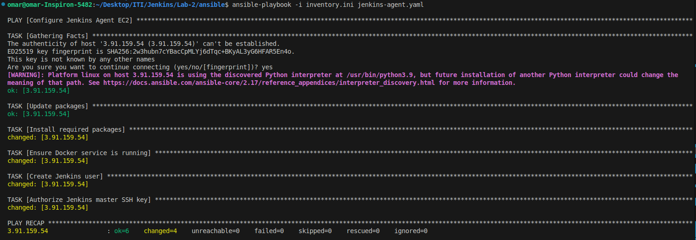

## Pipeline
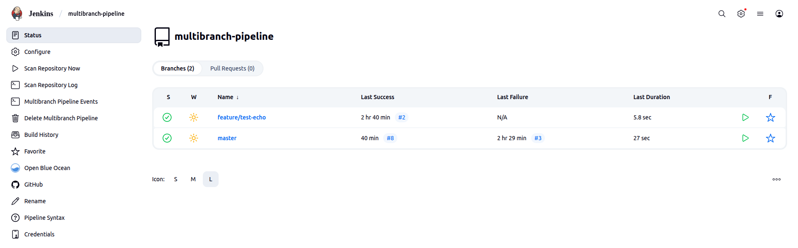

### Master branch
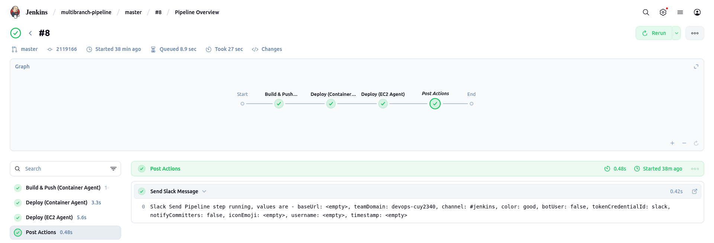

### Echo branch
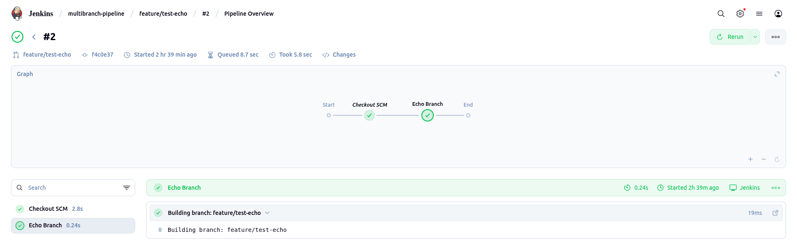

### Local app
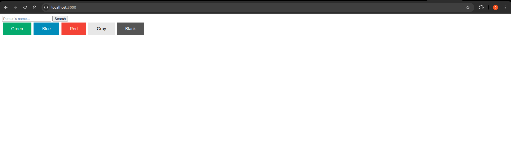

### EC2 app
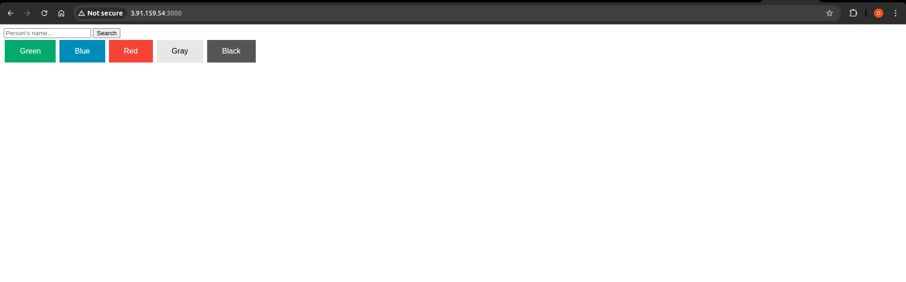

### Slack notifications
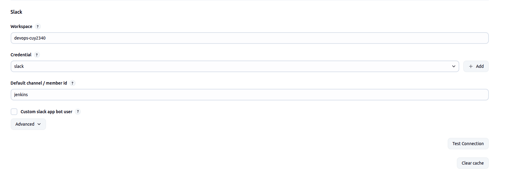
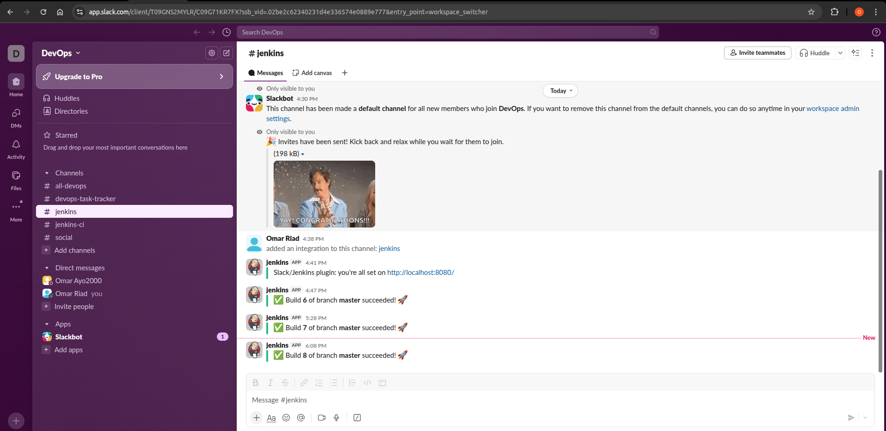

### Webhook
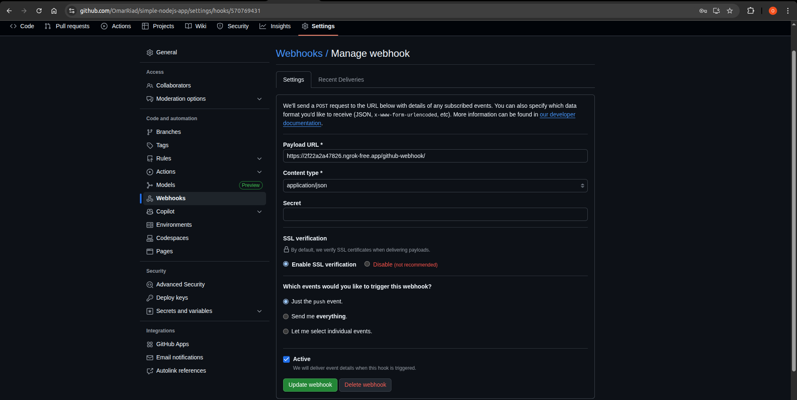
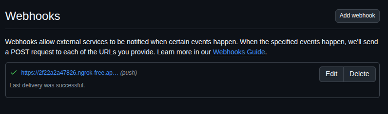