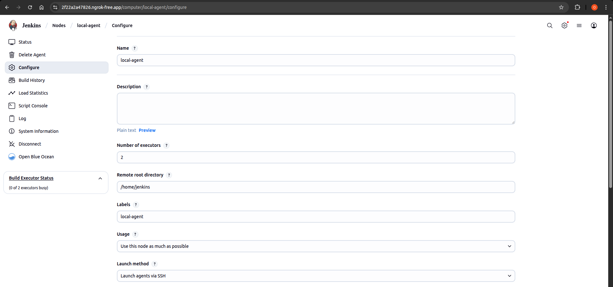

# Jenkins Lab 2

### Docker local node

### EC2 node

### All Nodes 

## Terraform
- terraform runs and creates ansible's `inventory.ini` in `/ansible` dynamically using `local_file` resource.

## Ansible

## Pipeline

### Master branch

### Echo branch

### Local app

### EC2 app

### Slack notifications

### Webhook

